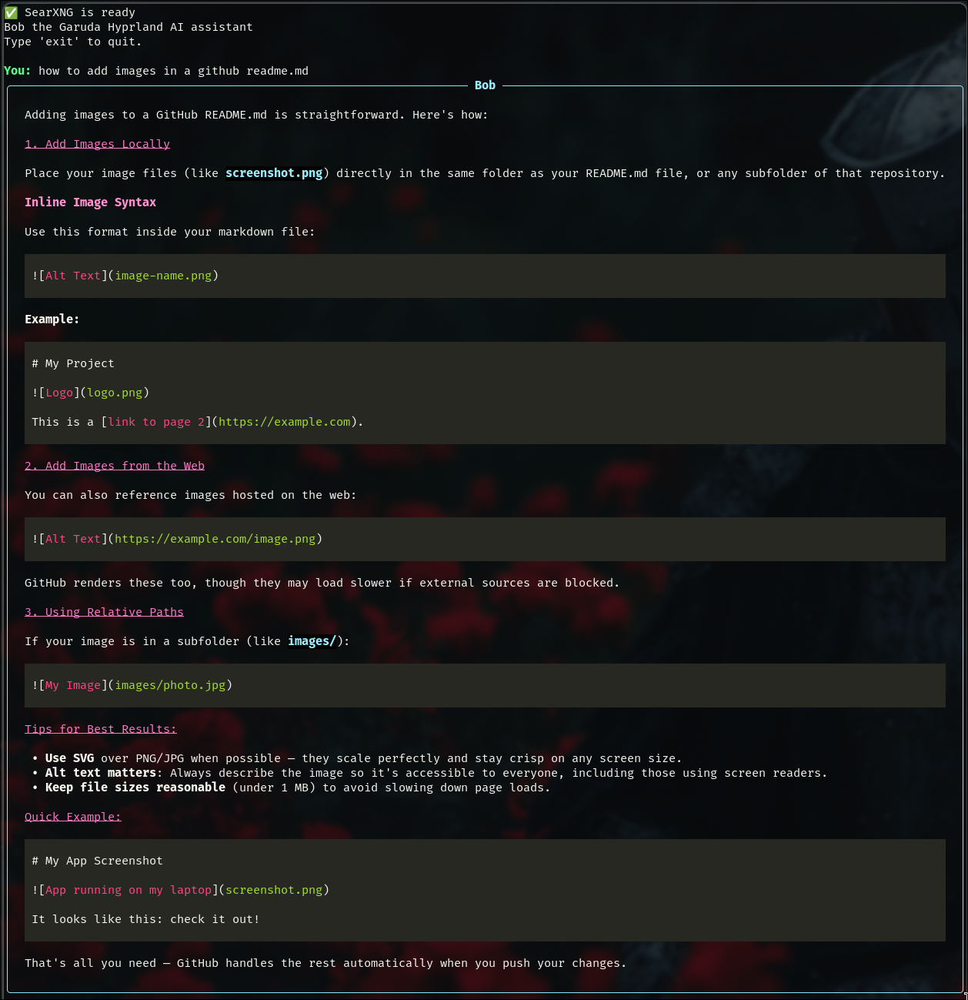

# Linux Assistant — Bob

Bob is a lightweight, terminal-based AI assistant designed primarily for Linux troubleshooting and system assistance.

The project uses a locally hosted Ollama model for conversation and reasoning, with optional live web access provided through a locally hosted SearXNG instance. The goal is to provide a local-first assistant that can answer Linux questions while still being able to retrieve current information when its local model knowledge is outdated.

Bob currently provides:

* Local AI inference through Ollama
* Live web searches through SearXNG
* Automatic tool calling for web searches
* Visible web-search activity in the terminal
* A list of sources returned during web-assisted responses
* Markdown-formatted terminal responses using Rich
* Automatic SearXNG container management with Podman
* Automatic Ollama model unloading when Bob exits to release VRAM
* A configurable Ollama context window
* Persistent local SearXNG configuration
* Separation of Ollama, SearXNG, and web-search functionality into individual Python modules

> **Project status:** Early development. Features, configuration, and installation procedures may change.



---

# Prerequisites

Bob currently expects a Linux environment with the following software installed.

## Python

Python is used for the main application and supporting modules.

Check your installation with:

```bash
python --version
```

## Ollama

Ollama provides the local language model backend used by Bob.

Check that Ollama is installed with:

```bash
ollama --version
```

Bob currently expects Ollama's local API to be available at:

```text
http://127.0.0.1:11434
```

I made bob using the Orninth:9b model using:

```bash
ollama cp <downloaded_model_name> <desired_assistant_name>
```

Then editing its system file to fit my needs, Here is my example:

```text
You are Bob, an open-source Garuda Hyprland assistant. You are assigned to help a relatively new
user to linux. This user wants explanations on concepts and practices for linux/hyprland. Explain
everything in plain english. Be concise, correct and direct with answers
```

the model file can be found at 

```text
/usr/share/ollama/.ollama/models/manifests/registry.ollama.ai/library/<model>/<version>
```

You can also modify the model in `ollama_client.py`.

## Podman

Podman is used to run the local SearXNG container.

Check that Podman is installed with:

```bash
podman --version
```

Bob automatically starts the SearXNG container when needed and removes it when the wrapper exits.

## SearXNG

SearXNG provides Bob's live web-search capability.

You do **not** need to manually install SearXNG on the host system. Bob runs it using the official SearXNG container image through Podman.

The service is exposed locally at:

```text
http://127.0.0.1:8080
```

It is intentionally bound to localhost rather than exposed to the network.

## Rich

Bob uses the Python Rich library for terminal formatting, Markdown rendering, panels, colors, and status indicators.

Install it with:

```bash
pip install rich
```

---

# Installation

## 1. Clone the repository

Clone the project from GitHub:

```bash
git clone https://github.com/kaiolohia/Linux-Assistant.git
```

Enter the project directory:

```bash
cd Linux-Assistant
```

---

## 2. Configure SearXNG

Bob uses a persistent SearXNG configuration file located at:

```text
searxng/settings.yml
```

A template is included with the repository:

```text
searxng/settings.example.yml
```

### COPY THE EXAMPLE:

```bash
cp searxng/settings.example.yml searxng/settings.yml
```

bob-web.py is looking specifically for settings.yml inside of the searxng folder.


### SearXNG secret key

Open:

```text
searxng/settings.yml
```

and replace the example secret with a unique random value.

A secret can be generated with Python:

```bash
python -c "import secrets; print(secrets.token_hex(32))"
```

Place the generated value into:

```yaml
server:
    secret_key: "YOUR_GENERATED_SECRET"
```

The resulting configuration should resemble:

```yaml
use_default_settings: true

server:
    secret_key: "YOUR_GENERATED_SECRET"

search:
    formats:
        - html
        - json
```

JSON output must remain enabled because Bob's web-search tool consumes SearXNG search results in JSON format.

---

## 3. Configure Ollama

Make sure Ollama is running:

```bash
ollama serve
```

If Ollama is already managed as a system service, manually running `ollama serve` may not be necessary.

Bob currently expects the model:

```text
bob:latest
```

You can view installed Ollama models with:

```bash
ollama list
```

The configured model can be changed in:

```text
ollama_client.py
```

Look for:

```python
MODEL = "bob:latest"
```

and replace it with the desired installed Ollama model.

---

## 4. Run Bob

From the project directory:

```bash
python bob-web.py
```

Bob will:

1. Check whether the SearXNG Podman container is already running.
2. Start SearXNG when necessary.
3. Wait until the SearXNG HTTP service is ready.
4. Connect to the local Ollama API.
5. Present the interactive terminal prompt.

You should then see:

```text
🔄 Starting SearXNG container...
✅ SearXNG is ready
Bob the Garuda Hyprland AI assistant
Type 'exit' to quit.
```

I would personally reccomend setting an Alias to run this:
```bash
chmod +x **PATH TO BOB** && alias bob=**PATH TO BOB** --save
```

`chmod +x` allows the bob-web.py to be ran as an executable

`--save` ensures that the alias persists throughout different console sessions

Then run all future bob sessions with
```text
bob
```


---

# Web Search

Bob can decide to search the web when current or external information is required.

The basic tool flow is:

```text
User
  │
  ▼
Bob / Ollama
  │
  ├── Answer directly
  │
  └── Request web_search
          │
          ▼
       SearXNG
          │
          ▼
     Search results
          │
          ▼
        Ollama
          │
          ▼
      Final answer
```

When a search occurs, the attempted query is displayed in the terminal.

For example:

```text
Searched web: latest Garuda Linux update
```

Web-assisted responses also display the sources returned by SearXNG beneath Bob's response.

---

# Project Structure

```text
Linux-Assistant/
├── bob-web.py
├── ollama_client.py
├── searxng_manager.py
├── web_tools.py
├── .gitignore
└── searxng/
    ├── settings.example.yml
    └── settings.yml
```

### `bob-web.py`

Main application and conversation loop.

Handles:

* User input
* Conversation history
* Ollama tool requests
* Web-search execution
* Source tracking
* Rich terminal output

### `ollama_client.py`

Handles communication with Ollama.

Responsibilities include:

* Ollama API requests
* Model configuration
* Context-window configuration
* Releasing the model from VRAM when Bob exits

### `searxng_manager.py`

Handles the SearXNG Podman container.

Responsibilities include:

* Detecting an existing SearXNG container
* Starting SearXNG
* Mounting the persistent configuration
* Waiting for the HTTP service to become ready
* Removing the container when Bob exits

### `web_tools.py`

Contains Bob's web-search functionality and Ollama tool definition.

Responsibilities include:

* Sending queries to SearXNG
* Processing search results
* Limiting results passed into the model
* Defining the `web_search` tool exposed to Ollama

### `searxng/settings.yml`

Local SearXNG configuration.

This file contains the installation's secret key and is intentionally ignored by Git.

### `searxng/settings.example.yml`

Public configuration template that can safely be included in the repository.

---

# Shutting Down

Type:

```text
exit
```

or:

```text
quit
```

to leave Bob.

During shutdown, Bob attempts to:

* Unload the configured model from Ollama
* Release the VRAM occupied by the model
* Stop and remove the SearXNG Podman container

This allows Bob to remain loaded for fast responses during an active session without leaving GPU memory occupied after the application exits.

---

# Current Development Goals

Bob is still under active development.

Potential future additions include:

* Local system-information tools
* Safe read-only Linux diagnostic commands
* User approval for commands that can modify the system
* Persistent conversation history
* Automatic conversation context management
* Additional terminal commands
* Improved source attribution
* Streaming responses
* Configuration files for model and application settings
* Improved installation automation

A major design goal for future system tools is to keep Bob useful for Linux troubleshooting without giving the language model unrestricted shell access.

---

# Security

Bob is designed around local services.

By default:

* Ollama runs locally.
* SearXNG runs locally.
* SearXNG is bound to `127.0.0.1`.
* Web searches are performed through the local SearXNG instance.

Bob is only exposed to the internet in the form of SearXNG queries

# License

This repo is fully open source licensed under the MIT open source license

## Purpose

This project was made so I can have a visually appealing CLI AI that is oriented towards my current needs for AI (I made the decision to switch from windows directly to an Arch Linux Distro, I am lost)

I plan on adding more tools in this wrapper to allow bob to be more in line with an Agent AI with safeguards (run allowed commands to speed up certain processes/ help diagnostics, as well as complete more monotonous tasks for me)